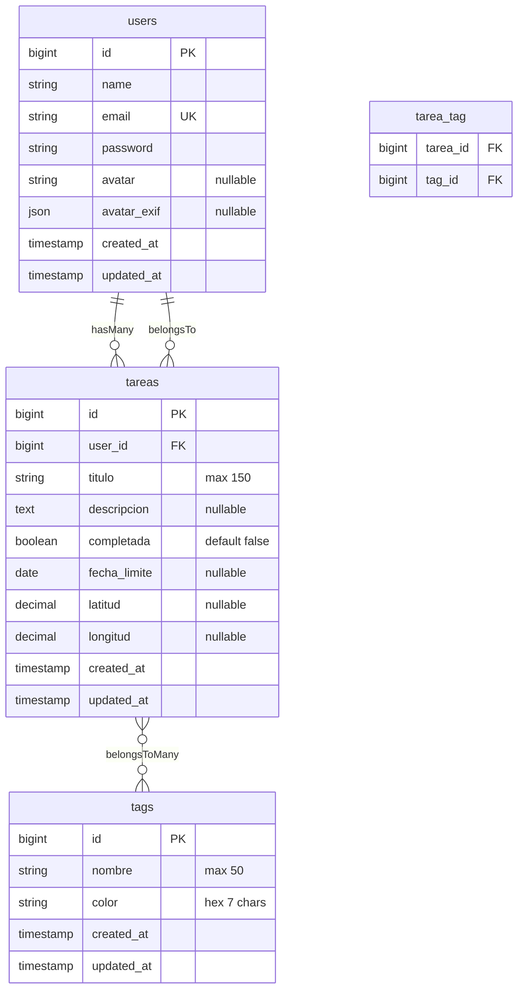

# Diagrama Entidad-Relación

## Estructura de la Base de Datos

## Relaciones

| Relación | Descripción |
|----------|-------------|
| User → Tareas | Un usuario tiene muchas tareas (hasMany) |
| Tarea → User | Una tarea pertenece a un usuario (belongsTo) |
| Tarea ↔ Tags | Relación muchos a muchos mediante tabla pivote `tarea_tag` |